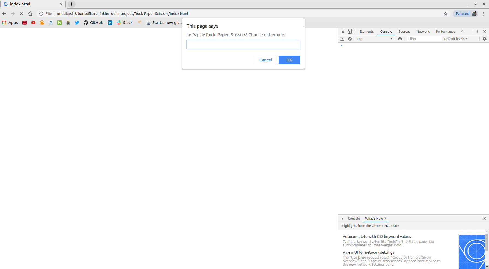

# Rock Paper Scissors game

## Description

This is my attempt at using my current knowledge in JavaScript to build the 'Rock Paper Scissors' game as instructed. At this point, no HTML or CSS is added yet, hence, the web page
being empty. 

*It is a 5 round game where the player plays against the computer and announces the winner of the round along with the points after each round.* After the fifth and last round, it 
displays a message with the player's total score and the computer's total score.

The game is very simple - the player chooses either Rock or Paper or Scissors and the computer does the same, having its own choice. Then, both choices will be compared to see whose
choice has beaten the other's choice which would mean a win for the choice that has beaten the other.

Rock beats Scissors, Paper beats Rock and Scissors beats Paper - all of which are combinations for a win. The inverse (for instance, Scissors against Rock) is a loss. A tie is when 
the choices are the same (e.g Paper against Paper).

*Every win accounts for 2 points, every loss for an obvious zero points and a tie accounts for no increments in the points of both player and computer.*

It is certainly interactive and every message of a win/loss/tie along with the points are displayed on the console.

## Preview of the game on the console tab 

## How to play the game on the web page

**The game will be played on the console (console tab of the web browser's - preferably Google Chrome - developer tools).**
**The instructions below are presumably for the game being played on the Google Chrome Web browser**

On the web page:

1. Click cancel when a dialog box with a message to play the game pops up. This is to not play the game just yet and to stop the web page from loading for now.

2. Right click anywhere on the web page.

3. On the list of options shown, click on Inspect. This opens the web browser's developer tools.

4. At the top of the developer tools are some tabs beginning with the Elements tab then Console tab etc. Click on the Console tab.

5. At the top left in between the arrow icons and the url address bar of the web browser is a looped arrow icon which upon clicking will reload the web page. Click the looped arrow 
   icon. 

6. You must expect the dialog box encountered in (1) to appear.

7. Now you can play the game. Good luck, if you've reached this step.

## Play the game on my web page

https://chelmerrox.github.io/Rock-Paper-Scissors/

## Author

Losalini Rokocakau **GitHub username:** *chelmerrox*