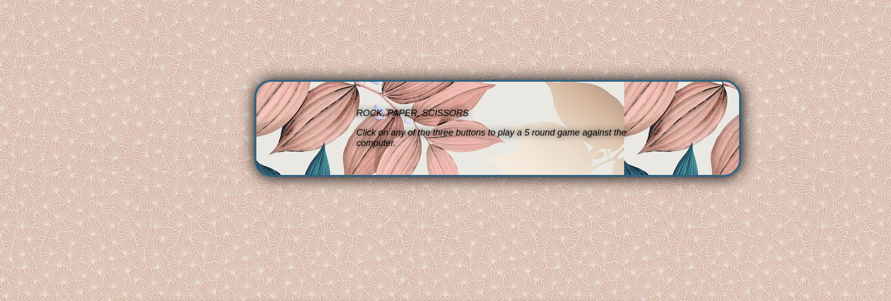

# Rock Paper Scissors game

## Description

This is my attempt at using my current knowledge in JavaScript to build the 'Rock Paper Scissors' game as instructed.  There is also a UI (User Interface) for this game which I have
built with HTML and CSS.

*It is a 5 round game where the player plays against the computer and announces the winner of the round along with the points after each round.* After the fifth and last round, it 
displays a message of the player's overall result along with the player's total score and the computer's total score.

The game is very simple - the player chooses either Rock or Paper or Scissors and the computer does the same, having its own choice. Then, both choices will be compared to see whose
choice has beaten the other's choice which would mean a win for the choice that has beaten the other.

Rock beats Scissors, Paper beats Rock and Scissors beats Paper - all of which are combinations for a win. The inverse (for instance, Scissors against Rock) is a loss. A tie is when 
the choices are the same (e.g Paper against Paper).

*Every win accounts for a point, every loss for an obvious zero points and a tie accounts for no increments in the points of both player and computer.*

It is certainly interactive and every message of a win/loss/tie along with the points are displayed on the web page.

## Preview of the game 

## How to play the game on the web page

On the web page:

1. Click on any of the three buttons for your choice. Rock image embedded on the button is for choosing rock etc.

## Play the game on my web page

https://chelmerrox.github.io/Rock-Paper-Scissors/

## Author

Losalini Rokocakau **GitHub username:** *chelmerrox*